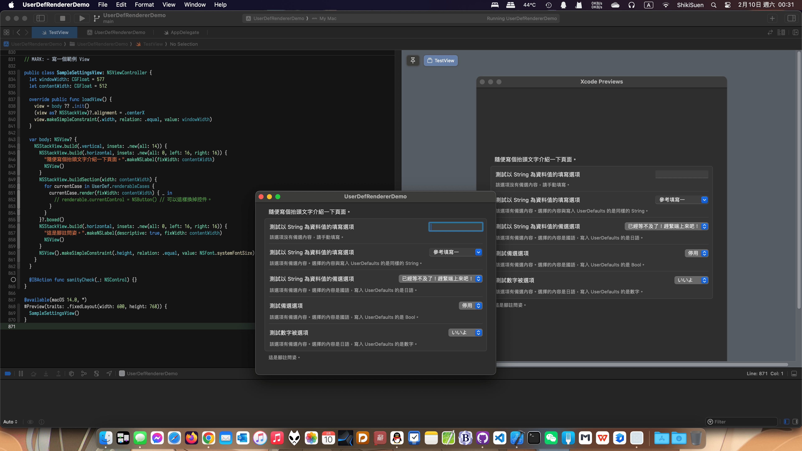

# UserDefRendererDemo

以純 AppKit 程式碼構建 macOS 偏好設定介面，示範如何透過宣告式 DSL 取代 Interface Builder，同時維持良好的 UserDefaults 管理與本地化體驗。



## 為什麼不用 Interface Builder？

- XIB/Storyboard 在版本控制下容易產生難以處理的 conflict。
- 圖形化排版難以與 SwiftUI 或其他程式化介面重複使用本地化資源。
- 介面調整需要反覆拖拉控制項，開發效率與一致性都受限。
- IB 預設行為可能與程式碼建立的控制項不一致，導致環境差異問題。

本專案以純程式碼建立 AppKit 偏好設定視窗，重現偏好設定頁常見的文字欄位、選單、開關等控件，並提供模組化 DSL，讓開發者能以 SwiftUI 式的宣告語法管理 AppKit 佈局。

## 核心特性

- **資料驅動的 UserDefaults enum (`UserDef`)**：將 key、資料型別、選項、提示文字等中繼資料集中管理。
- **宣告式 UI DSL**：`NSStackView.build(...)`、`ArrayBuilder` 與多種 AppKit extension 讓介面組裝接近 SwiftUI；支援插入分隔線、間距與邊距。
- **`UserDefRenderableCocoa` 渲染器**：根據 `UserDef.MetaData` 自動產生對應控制項，包含 `NSTextField`、`NSComboBox`、`NSPopUpButton`、`NSSwitch` 等。
- **測試友善的 `UserDefaults` 管理**：`UserDefaults.current` 與 `pendingUnitTests` 讓單元測試可切換到專用 suite。
- **範例偏好設定頁**：`SampleSettingsView` 展示如何組合區段、群組、說明文字與框線，構成完整偏好設定視窗。

## 專案結構

```
UserDefRendererDemo/
├─ UserDefRendererDemo/                # App 主專案 (AppDelegate、資產等)
├─ Packages/TestView/Sources/TestView/ # 核心 DSL 與範例視圖
└─ README.md                           # 本文件
```

主要邏輯集中於 `Packages/TestView/Sources/TestView/TestView.swift`：

- **Extensions 區塊**：擴充 `NSView`、`NSStackView`、`NSMenu`、`String`、`NSAttributedString` 等以支援 DSL 語法。
- **UserDef 定義**：描述每個偏好設定項目的 key、資料型別、顯示文字、選項與最低系統需求。
- **Renderable 層**：`UserDefRenderableCocoa` 將 MetaData 轉換為具配置能力的控制項與描述文字。
- **Demo 視圖**：`SampleSettingsView` 示範如何組合 renderable 產出視圖，並透過 `#Preview` 在 Xcode Canvas 檢視。

## 快速開始

1. 使用 Xcode 15+ 開啟 `UserDefRendererDemo.xcodeproj`。
2. 執行 target `UserDefRendererDemo`，即可看到以程式碼構建的偏好設定視窗。
3. 在 `SampleSettingsView` 內調整 `windowWidth`、區段組合或 `UserDef.render(...)` 呼叫，觀察 DSL 的彈性。

如需於現有 App 內套用：

1. 將 `TestView` 套件中的程式碼搬移到專案 (或改為 Swift Package 依賴)。
2. 建立自有的 `enum YourUserDef: String` 並符合 `UserDefProtocol`，為每個偏好設定項目撰寫 `MetaData`。
3. 建立新的 `YourSettingsViewController`，參考 `SampleSettingsView` 佈局。

## 自訂與擴充

- **擴充資料型別**：在 `UserDef.DataType` 及 `renderFunctionControl()` 中加入新的 case，對應到自訂控制項即可。
- **調整 UI 細節**：`NSStackView.buildSection` 支援自訂 spacing、divider、寬度等參數，亦可透過 `withInsets` 控制邊距。
- **共用本地化**：所有與使用者互動的文字皆透過 `String.localized`，可與 SwiftUI 共享 Localizable 資料。
- **快照備份**：`UserDef.Snapshot` 提供簡易快照結構，可用於匯入匯出設定或單元測試驗證。

## 測試與品質

- `UserDefaults.pendingUnitTests` 與 `UserDefaults.current` 已準備好測試模式切換，歡迎加入 `XCTest` 專案以驗證渲染結果或快照功能。
- 建議以 ViewModel 或小型 wrapper 測試 `UserDefRenderableCocoa` 產生的控制項配置，確保新選項加入後行為一致。

## 未來方向

- 將長檔案拆分為多個 Swift 檔案或 Swift Package target，提升可維護性。
- 補齊 double / array / dictionary 型資料的範例控制項與單元測試。
- 提供命令列或 GitHub Actions 工作流程以自動化建置與靜態分析。

## 授權

本專案採用 MIT-NTL License，詳見 `LICENSE.txt`。

$ EOF.
